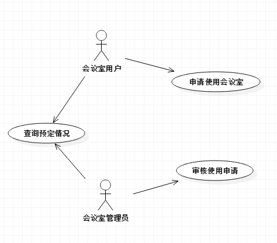
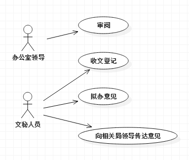
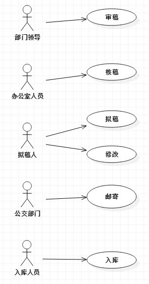
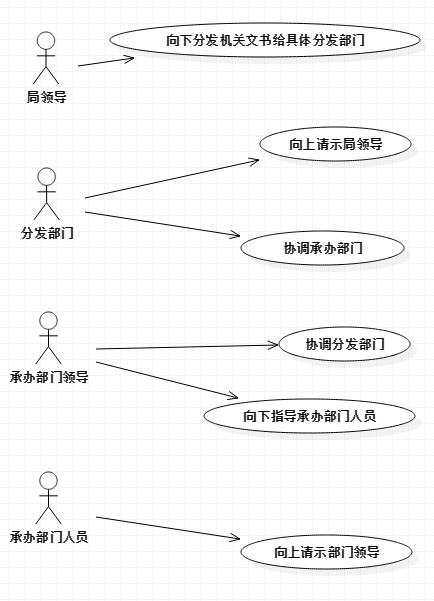
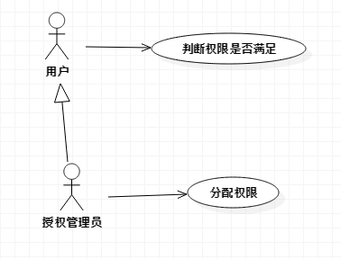

实验
===

<<<<<<< HEAD
## 会议管理

### 用例图



### 用例规约

| 用例名称   | 查询预定情况                                   |
| ------ | ---------------------------------------- |
| 参与者    | 任意用户                                     |
| 用例简述   | 用户可以通过该用例查询会议室的预定情况                      |
| 前置条件   | 用户能够访问系统                                 |
| 后置条件   | 返回查询结果                                   |
| 基本事件流  | 1. 用户发出查询请求<br />2. 系统返回查询结果<br />3. 此用例成功结束 |
| 备选事件流  | 无                                        |
| 非功能性需求 | 1. 所有请求和返回都通过https加密传输，保证安全性             |

| 用例名称   | 申请使用会议室                                  |
| ------ | ---------------------------------------- |
| 参与者    | 会议室用户                                    |
| 用例简述   | 用户可以通过该用例申请使用会议室                         |
| 前置条件   | 用户能够访问系统                                 |
| 后置条件   | 返回申请发送状态                                 |
| 基本事件流  | 1. 用户发出申请请求<br />2. 管理员判定用户所请求会议室是否可以使用<br />3. 系统返回申请成功<br />4. 此用例成功结束 |
| 备选事件流  | 无                                        |
| 非功能性需求 | 1. 所有请求和返回都通过https加密传输，保证安全性             |

| 用例名称   | 审核使用申请                                   |
| ------ | ---------------------------------------- |
| 参与者    | 会议室管理员                                   |
| 用例简述   | 会议室管理员可以通过该用例审核用户使用申请                    |
| 前置条件   | 用户已发出申请请求，管理员可以访问系统                      |
| 后置条件   | 1. 用例成功结束<br />1.1 返回审核结果<br />2. 用例失败结束<br />2.1 返回失败原因 |
| 基本事件流  | 1. 管理员审核用户请求<br />2. 系统返回审核结果<br />3. 此用例成功结束 |
| 备选事件流  | 1. 若系统发现会议室已被占用<br />1.1 此用例失败结束         |
| 非功能性需求 | 1. 所有请求和返回都通过https加密传输，保证安全性             |

### 服务描述

### 接口设计

+ 查询请求

  + token
    + 用户所使用的id
  + roomId
    + 用户查询的房间号

   ```http
  GET /room/query?token=123&roomId=1234 HTTP/1.1
   ```

  + id
    + 申请的Id
  + schedule
    + 房间的占用预定列表
  + from
    + 占用时间区间开头
  + to
    + 占用时间区间结尾
  + user
    + 用户的id

=======
收文管理
---

### 用例图



### 用例规约

| 用例名称   | 审阅                                       |
| ------ | ---------------------------------------- |
| 参与者    | 办公室领导                                    |
| 用例简述   | 该用例规定了办公室领导审阅收文并提出意见                     |
| 前置条件   | 文秘人员对收文报送到办公室领导处                         |
| 后置条件   | 稿件文成审阅，并带有相关意见送往文秘人员                     |
| 基本事件流  | 1. 办公室领导获取需要审阅的收文<br />2. 办公室领导对收文进行审理<br />3. 办公室领导发送审阅结果<br />4. 此用例成功结束 |
| 备选事件流  | 无                                        |
| 非功能性需求 | 1. 所有请求返回通过 HTTPS 加密传输，保证其安全性            |

| 用例名称   | 收文登记                                     |
| ------ | ---------------------------------------- |
| 参与者    | 文秘人员                                     |
| 用例简述   | 该用例规定了文秘人员对收文进行登记                        |
| 前置条件   | 文秘人员收到文件，需要进行登记                          |
| 后置条件   | 收文完成登记，将交由办公室领导进行审阅                      |
| 基本事件流  | 1. 文秘人员获取需要登记的收文<br />2. 文秘人员对收文进行登记<br />3. 文秘人员发送登记结果<br />4. 此用例成功结束 |
| 备选事件流  | 无                                        |
| 非功能性需求 | 1. 所有请求返回通过 HTTPS 加密传输，保证其安全性            |

| 用例名称   | 拟办意见                                     |
| ------ | ---------------------------------------- |
| 参与者    | 文秘人员                                     |
| 用例简述   | 该用例规定了文秘人员对收文进行拟办意见                      |
| 前置条件   | 办公室领导完成审阅，需要进行拟办意见                       |
| 后置条件   | 收文完成拟办意见，将交向相关局领导传达意见                    |
| 基本事件流  | 1. 文秘人员获取需要拟办意见的收文<br />2. 文秘人员对收文进行拟办意见<br />3. 文秘人员发送拟定的收文<br />4. 此用例成功结束 |
| 备选事件流  | 无                                        |
| 非功能性需求 | 1. 所有请求返回通过 HTTPS 加密传输，保证其安全性            |

| 用例名称   | 传达意见                                     |
| ------ | ---------------------------------------- |
| 参与者    | 文秘人员                                     |
| 用例简述   | 该用例规定了文秘人员向相关局领导传达意见                     |
| 前置条件   | 有收文完成拟办意见，需要向相关局领导传达意见                   |
| 后置条件   | 收文完成向相关局领导传达意见                           |
| 基本事件流  | 1. 文秘人员获取需要向相关局领导传达意见的收文<br />2. 文秘人员对收文进行向相关局领导传达意见<br />3. 此用例成功结束 |
| 备选事件流  | 无                                        |
| 非功能性需求 | 1. 所有请求返回通过 HTTPS 加密传输，保证其安全性            |

### 服务描述

本系统的每位用户

### 接口设计

* 获取收文

  * uid
    * 请求发文的用户id
  * aid
    * 请求的发文id

  ```http
  GET /article?uid=${uid}&aid=${aid} HTTP/1.1
  ```

  * state
    * 发送成功时返回0，失败时为1
  * msg
    * 发送成功或失败的描述
  * content
    * 发文的具体内容
>>>>>>> 4c658a7b7b3bcae22f5b0bb53a14f37cc689bfb6
  ```json
  HTTP/1.1 200 OK
  Content-Type: application/vnd.api+json

  {
<<<<<<< HEAD
    "schedule": [
      {
        "id": 1,
        "from": 10000,
        "to": 20000,
        "user": "userId"
      }
    ]
  }
  ```

+ 申请使用

  + token
    + 用户所使用的Id
  + roomId
    + 预定的房间号
  + from
    + 预定的开始时间
  + to
    + 预定的结束时间

  ```http
  POST /room/register HTTP/1.1
  Content-Type: application/x-www-form-urlencoded

  token=&roomId=&from=&to=
  ```

  + id
    + 申请的id号
  + state
    + 申请成功发送时返回0，其余为1
  + msg
    + 对于申请的其他详细描述
=======
    "state": 0,
    "msg": "Success",
    "content": "这是一条收文"
  }
  ```

* 发送结果

  * uid
    * 请求发文的用户id
  * aid
    * 请求的发文id
  * commentType
    * 对发文评价的类型，分为审稿、核稿、修改等
  * comment
    * 评价的内容

  ```http
  POST /office/request HTTP/1.1
  Content-Type: application/vnd.api+json
  Accept: application/vnd.api+json

  uid=123&aid=456&commentType=1&comment=这是一条意见
  ```

  * state
    * 发送成功时返回0，失败时为1
  * msg
    * 发送成功或失败的描述
>>>>>>> 4c658a7b7b3bcae22f5b0bb53a14f37cc689bfb6

  ```json
  HTTP/1.1 200 OK
  Content-Type: application/vnd.api+json

  {
<<<<<<< HEAD
    "id": 1
    "state": 0,
    "msg": ""
  }
  ```

+ 获取申请列表

  + token
    + 用户id

  ```http
  GET /room/register?token=123 HTTP/1.1
  ```

  + register
    + 申请列表
  + id
    + 申请id
  + room
    + 申请的房间号
  + from
    + 申请使用时间区间开始
  + to
    + 申请使用时间区间结束
  + user
    + 申请人id
=======
    "state": 0,
    "msg": "Success"
  }
  ```

发文管理
---

### 用例图



### 用例规约

| 用例名称   | 审稿                                       |
| ------ | ---------------------------------------- |
| 参与者    | 部门领导                                     |
| 用例简述   | 该用例规定了部门领导对稿件进行审理                        |
| 前置条件   | 有稿件完成拟稿，需要部门领导进行审稿                       |
| 后置条件   | 稿件完成审稿，将交由办公室进行核稿                        |
| 基本事件流  | 1. 部门领导获取需要审理的稿件<br />2. 部门领导对稿件进行审理<br />3. 部门领导发送审理结果<br />4. 此用例成功结束 |
| 备选事件流  | 无                                        |
| 非功能性需求 | 1. 所有请求返回通过 HTTPS 加密传输，保证其安全性            |

| 用例名称   | 核稿                                       |
| ------ | ---------------------------------------- |
| 参与者    | 办公室人员                                    |
| 用例简述   | 该用例规定了办公室人员对稿件进行核查                       |
| 前置条件   | 有稿件完成审稿，需要部门领导进行核稿                       |
| 后置条件   | 稿件完成核稿，将交由拟稿人进行修改                        |
| 基本事件流  | 1. 办公室人员获取需要核查的稿件<br />2. 办公室人员对稿件进行核查<br />3. 办公室人员发送核查结果<br />4. 此用例成功结束 |
| 备选事件流  | 无                                        |
| 非功能性需求 | 1. 所有请求返回通过 HTTPS 加密传输，保证其安全性            |

| 用例名称   | 拟稿                                       |
| ------ | ---------------------------------------- |
| 参与者    | 拟稿人                                      |
| 用例简述   | 该用例规定了拟稿人对稿件进行拟定                         |
| 前置条件   | 需要一篇新的稿件                                 |
| 后置条件   | 稿件完成拟稿，将交由部门领导审稿                         |
| 基本事件流  | 1. 拟稿人获取需要拟定的稿件<br />2. 拟稿人对稿件进行拟定<br />3. 拟稿人发送拟定的稿件<br />4. 此用例成功结束 |
| 备选事件流  | 无                                        |
| 非功能性需求 | 1. 所有请求返回通过 HTTPS 加密传输，保证其安全性            |

| 用例名称   | 修改                                       |
| ------ | ---------------------------------------- |
| 参与者    | 拟稿人                                      |
| 用例简述   | 该用例规定了拟稿人对稿件进行修改                         |
| 前置条件   | 有稿件完成核稿，需要拟稿人进行修改                        |
| 后置条件   | 稿件完成修改，将交由公交部门进行邮寄                       |
| 基本事件流  | 1. 拟稿人获取需要修改的稿件<br />2. 拟稿人对稿件进行修改<br />3. 拟稿人发送修改的结果<br />4. 此用例成功结束 |
| 备选事件流  | 无                                        |
| 非功能性需求 | 1. 所有请求返回通过 HTTPS 加密传输，保证其安全性            |

| 用例名称   | 邮寄                                       |
| ------ | ---------------------------------------- |
| 参与者    | 公交部门                                     |
| 用例简述   | 该用例规定了公交部门对稿件进行邮寄                        |
| 前置条件   | 有稿件完成修改，需要公交部门进行邮寄                       |
| 后置条件   | 有稿件完成邮寄，需要入库人员进行入库                       |
| 基本事件流  | 1. 公交部门获取需要邮寄的稿件<br />2. 公交部门对稿件进行邮寄<br />3. 公交部门发送邮寄的结果<br />4. 此用例成功结束 |
| 备选事件流  | 无                                        |
| 非功能性需求 | 1. 所有请求返回通过 HTTPS 加密传输，保证其安全性            |

| 用例名称   | 入库                                       |
| ------ | ---------------------------------------- |
| 参与者    | 入库部门                                     |
| 用例简述   | 该用例规定了入库部门对稿件进行入库                        |
| 前置条件   | 有稿件完成邮寄，需要入库部门进行入库                       |
| 后置条件   | 有稿件完成入库                                  |
| 基本事件流  | 1. 入库部门获取需要入库的稿件<br />2. 入库部门对稿件进行入库<br />3. 入库部门发送邮寄的结果<br />4. 此用例成功结束 |
| 备选事件流  | 无                                        |
| 非功能性需求 | 1. 所有请求返回通过 HTTPS 加密传输，保证其安全性            |

### 服务描述

本系统的每位用户

### 接口设计

* 获取发文

  * uid
    * 请求发文的用户id
  * aid
    * 请求的发文id

  ```http
  GET /article?uid=${uid}&aid=${aid} HTTP/1.1
  ```

  * state
    * 发送成功时返回0，失败时为1
  * msg
    * 发送成功或失败的描述
  * content
    * 发文的具体内容
  ```json
  HTTP/1.1 200 OK
  Content-Type: application/vnd.api+json

  {
    "state": 0,
    "msg": "Success",
    "content": "这是一条发文"
  }
  ```

* 发送结果

  * uid
    * 请求发文的用户id
  * aid
    * 请求的发文id
  * commentType
    * 对发文评价的类型，分为审稿、核稿、修改等
  * comment
    * 评价的内容

  ```http
  POST /office/request HTTP/1.1
  Content-Type: application/vnd.api+json
  Accept: application/vnd.api+json

  uid=123&aid=456&commentType=1&comment=这是一条评价
  ```

  * state
    * 发送成功时返回0，失败时为1
  * msg
    * 发送成功或失败的描述
>>>>>>> 4c658a7b7b3bcae22f5b0bb53a14f37cc689bfb6

  ```json
  HTTP/1.1 200 OK
  Content-Type: application/vnd.api+json

  {
<<<<<<< HEAD
    "register": [
      {
        "id": 1,
        "room": 123,
        "from": 100000,
        "to": 200000,
        "user": 3333
      }
    ]
  }
  ```


+ 审核申请

  + token
    + 用户id
  + id
    + 申请id
  + action
    + 审核结果，0代表通过，1代表拒绝

  ```http
  POST /room/register HTTP/1.1
  Content-Type: application/x-www-form-urlencoded

  token=&id=&action=
  ```

  + state
    + 审核状态，0代表审核成功提交，否则为1
  + msg
    + 详细信息
=======
    "state": 0,
    "msg": "Success"
  }
  ```

办文管理
---

### 用例图



### 用例规约

| 用例名称   | 分发文书                                     |
| ------ | ---------------------------------------- |
| 参与者    | 分发部门、局领导                                 |
| 用例简述   | 该用例规定了局领导向下分发机关文书给分发部门                   |
| 前置条件   | 局领导需要分发机关文书                              |
| 后置条件   | 分发部门获得局领导分发的机关文书                         |
| 基本事件流  | 1. 局领导向下分发机关文书给具体部门<br />2. 分发部门获得局领导分发的机关文书<br />3. 此用例成功结束 |
| 备选事件流  | 无                                        |
| 非功能性需求 | 1. 有强大的高并发处理能力，每秒至少能处理 10000 条请求         |

| 用例名称   | 向上请示局领导                                  |
| ------ | ---------------------------------------- |
| 参与者    | 分发部门、局领导                                 |
| 用例简述   | 该用例规定了分发部门向上请示局领导                        |
| 前置条件   | 分发部门需要向上请示局领导                            |
| 后置条件   | 局领导获取分发部门的请求                             |
| 基本事件流  | 1. 分发部门向上请示局领导<br />2. 局领导获取分发部门的请求<br />3. 此用例成功结束 |
| 备选事件流  | 无                                        |
| 非功能性需求 | 1. 有强大的高并发处理能力，每秒至少能处理 10000 条请求         |

| 用例名称   | 协调承办部门                                   |
| ------ | ---------------------------------------- |
| 参与者    | 分发部门、承办部门领导                              |
| 用例简述   | 该用例规定了分发部门协调承办部门领导                       |
| 前置条件   | 分发部门需要协调承办部门领导                           |
| 后置条件   | 承办部门领导获取分发部门的协调请求                        |
| 基本事件流  | 1. 分发部门协调承办部门领导<br />2. 承办部门领导获取分发部门的协调请求<br />3. 此用例成功结束 |
| 备选事件流  | 无                                        |
| 非功能性需求 | 1. 有强大的高并发处理能力，每秒至少能处理 10000 条请求         |

| 用例名称   | 协调分发部门                                   |
| ------ | ---------------------------------------- |
| 参与者    | 分发部门、承办部门领导                              |
| 用例简述   | 该用例规定了承办部门领导协调分发部门                       |
| 前置条件   | 承办部门领导需要协调分发部门                           |
| 后置条件   | 分发部门获取承办部门领导的请求                          |
| 基本事件流  | 1. 承办部门领导协调分发部门<br />2. 分发部门获取承办部门领导的协调请求<br />3. 此用例成功结束 |
| 备选事件流  | 无                                        |
| 非功能性需求 | 1. 有强大的高并发处理能力，每秒至少能处理 10000 条请求         |

| 用例名称   | 指导人员                                     |
| ------ | ---------------------------------------- |
| 参与者    | 承办部门领导、承办部门人员                            |
| 用例简述   | 该用例规定了承办部门领导向下指导承办部门人员                   |
| 前置条件   | 承办部门领导需要向下指导承办部门人员                       |
| 后置条件   | 指导承办部门人员获得承办部门领导的领导                      |
| 基本事件流  | 1. 承办部门领导向下指导承办部门人员<br />2. 指导承办部门人员获得承办部门领导的领导<br />3. 此用例成功结束 |
| 备选事件流  | 无                                        |
| 非功能性需求 | 1. 有强大的高并发处理能力，每秒至少能处理 10000 条请求         |

| 用例名称   | 向上请示部门领导                                 |
| ------ | ---------------------------------------- |
| 参与者    | 承办部门人员、承办部门领导                            |
| 用例简述   | 该用例规定了承办部门人员向上请示承办部门领导                   |
| 前置条件   | 承办部门人员需要向上请示承办部门领导                       |
| 后置条件   | 承办部门领导获取承办部门人员的请求                        |
| 基本事件流  | 1. 承办部门人员向上请示承办部门领导<br />2. 承办部门领导获取承办部门人员的请求<br />3. 此用例成功结束 |
| 备选事件流  | 无                                        |
| 非功能性需求 | 1. 有强大的高并发处理能力，每秒至少能处理 10000 条请求         |

### 服务描述

本系统的每位用户

### 接口设计

* 发送办文请求

  * sendUid
    * 发送方用户所使用的id
  * receiveUid
    * 接收方用户所请求的操作
  * content
    * 发送的请求具体公文信息

  ```http
  POST /office/request HTTP/1.1
  Content-Type: application/vnd.api+json
  Accept: application/vnd.api+json

  sendUid=123&receiveUid=456&content=这是一条办文请求
  ```

  * state
    * 发送成功时返回0，失败时为1
  * msg
    * 发送成功或失败的描述
>>>>>>> 4c658a7b7b3bcae22f5b0bb53a14f37cc689bfb6

  ```json
  HTTP/1.1 200 OK
  Content-Type: application/vnd.api+json

  {
    "state": 0,
<<<<<<< HEAD
    "msg": "success"
  }
  ```

  ​

## 权限管理
=======
    "msg": "Success"
  }
  ```


权限管理
---
>>>>>>> 4c658a7b7b3bcae22f5b0bb53a14f37cc689bfb6

### 用例图



### 用例规约

| 用例名称   | 判断权限是否满足                                 |
| ------ | ---------------------------------------- |
| 参与者    | 任意用户                                     |
| 用例简述   | 该用例规定了用户判断是否有相应的权限完成某项操作                 |
| 前置条件   | 当任意用户发出某项操作时，系统会自动调用权限管理服务，判断权限是否满足      |
| 后置条件   | 若权限满足，则执行相应的服务，否则，返回权限错误提示               |
| 基本事件流  | 1. 用户发出人已请求<br />2. 系统自动将请求拦截，并使用权限管理服务的权限判断<br />3. 权限管理服务再将请求的信息发向其他目标服务<br />4. 此用例成功结束 |
| 备选事件流  | 1. 如果在基本事件流步骤 2 中权限判断不满足<br />1.1 返回错误提示，并抛弃这次请求<br />1.2 此用户失败结束 |
| 发生频率   | 每次用户提交一项请求，都会进行权限判断                      |
| 非功能性需求 | 1. 有强大的高并发处理能力，每秒至少能处理 10000 条权限判断请求     |

| 用例名称   | 分配权限                                     |
| ------ | ---------------------------------------- |
| 参与者    | 权限管理员、被分配权限的用户                           |
| 用例简述   | 该用例规定了权限管理员对其他用户进行响应权限的分配，让其他用户拥有某项操作的权限 |
| 前置条件   | 分配管理员需要有分配权限的权限                          |
| 后置条件   | 被分配权限的用户获得某项操作的权限                        |
| 基本事件流  | 1. 权限管理员发起为某用户分配权限的请求<br />2. 被分配权限的用户获得某项操作的权限<br />3. 此用例成功结束 |
| 备选事件流  | 1. 如果在基本事件流步骤 2 中被分配权限的用户已有响应权限<br />1.1 直接返回，不需要再进行分配操作 |
| 发生频率   | 每次用户权限管理员对其他用户进行响应权限的分配，都会进行权限分配         |
| 非功能性需求 | 1. 有强大的高并发处理能力，每秒至少能处理 10000 条权限分配请求     |

### 服务描述

本系统的每位用户

### 接口设计

* 判权请求

  * uid
    * 用户所使用的id
  * action
    * 用户所请求的操作

  ```http
  GET /auth?token=${uid}&action=${action} HTTP/1.1
  ```

  * state
    * 授权成功该接口不返回，失败时为1
  * msg
    * 授权失败的描述

  ```json
  HTTP/1.1 200 OK
  Content-Type: application/vnd.api+json

  {
    "state": 1,
    "msg": "No permission."
  }
  ```

* 分配请求

  * uid
    * 用户所使用的id
  * permissionId
    * 授权用户所请求的权限id
  * permission
    * 授权的具体权限

  ```http
  PATCH /auth HTTP/1.1
  Content-Type: application/vnd.api+json
  Accept: application/vnd.api+json

  {
    "uid": "123",
    "permissionId": "456",
    "permission": 1
  }
  ```

  * state
    * 授权成功时返回0，失败时为1
  * msg
    * 授权成功或失败的描述

  ```json
  HTTP/1.1 200 OK
  Content-Type: application/vnd.api+json

  {
    "state": 0,
    "msg": "Success"
  }
  ```

  ​